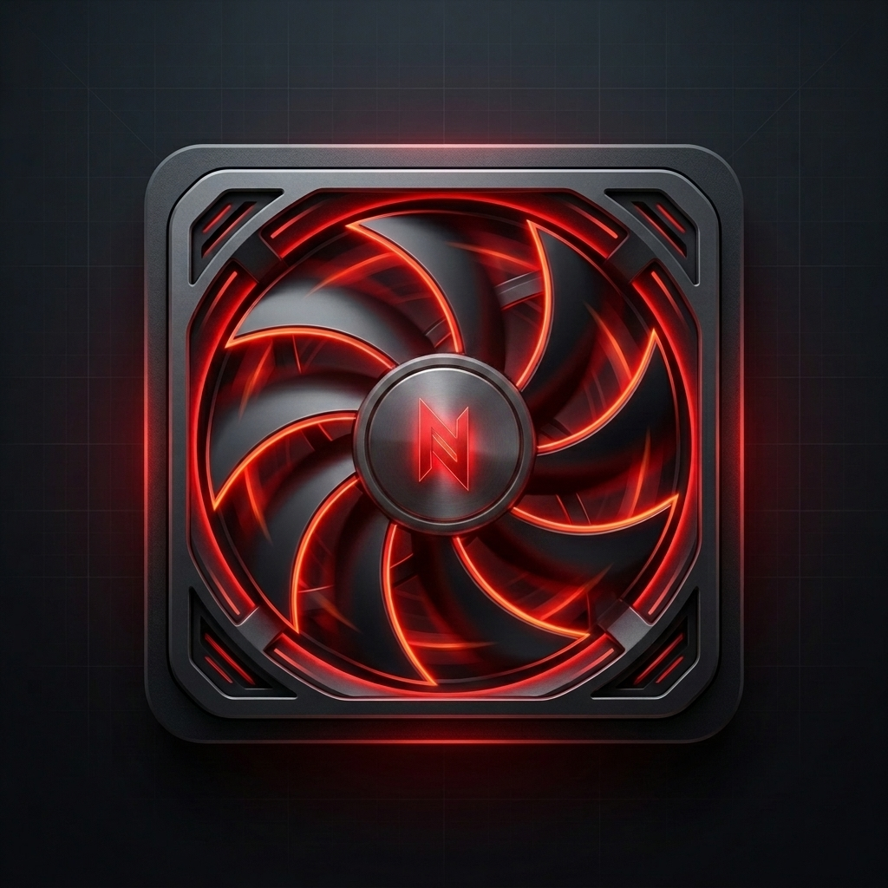

# ⚡ OpeNitro

<p align="center">
  
</p>

<p align="center">
  <b>A ultra-lightweight, high-performance, and resource-efficient Acer NitroSense alternative designed for Linux.</b>
</p>

<p align="center">
  
  
  
  
</p>

---

## 🌟 Key Features

* **🏎️ Zero-Lag Hotkey Listener**: Runs as a low-overhead systemd service monitoring the physical keyboard controller. Press the **OpeNitro** key (`XF86Launch2`), and the GUI pops up instantly.
* **❄️ Dual Fan Control**: Adjust both CPU and GPU fans independently. Set to **Auto** mode, blast it to **Max (Turbo)**, or adjust precision sliders in **Manual** mode.
* **🔋 Advanced Battery Care**: Limit your battery charge level to **80%** with automated daemon reinforcement to preserve hardware lifespan during continuous AC usage.
* **🔥 Dynamic Power Profiles**: Seamlessly switch between performance profiles (**Quiet**, **Default**, and **Extreme**) on the fly.
* **🎮 Sleek Gaming UI**: Designed in PyQt6 with custom vector-drawn animated cooling fans rotating dynamically relative to actual RPM speeds, alongside real-time thermal gauges.
* **🛡️ Secure EC Communication**: Utilizes thread-safe file operations for low-level ACPI/EC registers to avoid telemetry corruption.

---

## 🗺️ Supported Devices

OpeNitro is primarily tailored for the **Acer Nitro 5 (AN515-57)**, but is compatible with several other models sharing the same Embedded Controller layout.

👉 **[View the full compatibility table & verified models](supported_devices.md)**

---

## ⚡ Installation

### 📋 Prerequisites

Ensure Python 3 and PyQt6 are installed on your Linux system. For Arch Linux & CachyOS:

```bash
sudo pacman -S python pyqt6
```

### 🚀 Setup Steps

1. **Clone the Repository**:
   ```bash
   git clone https://github.com/trwinner9/OpeNitro.git
   cd OpeNitro
   ```

2. **Execute the Installer**:
   ```bash
   sudo ./install.sh
   ```

> [!IMPORTANT]
> The installer copies all source files to `/opt/openitro/`, establishes command-line wrappers inside `/usr/local/bin/`, registers the systemd daemon (`openitrod`), and places the desktop icon and shortcut menu item.

---

## 🛠️ Usage

### 🎛️ Graphical Interface (GUI)
- Open OpeNitro by pressing the dedicated physical **OpeNitro key** on your keyboard.
- Alternatively, launch it from your application menu (under "OpeNitro") or execute:
  ```bash
  openitro-gui
  ```

### 🖥️ Command Line Interface (CLI)
For quick headless control, query or change settings directly from your terminal:

```bash
# Display live system thermals and fan RPM speeds
openitro-cli --status

# Output status in raw JSON format (ideal for custom status bars or scripts)
openitro-cli --status --json

# Set performance mode profile
openitro-cli --power quiet       # Options: quiet, default, extreme

# Toggle the 80% battery protection limit
openitro-cli --battery-limit on  # Options: on, off

# Manually override CPU fan speed (value scale: 0-200)
openitro-cli --cpu-fan manual --cpu-speed 150
```

### ⚙️ Daemon Management
Manage the keyboard interceptor and battery limit enforcement daemon using systemd:

```bash
# Check daemon logs and status
systemctl status openitrod

# Restart the service
sudo systemctl restart openitrod
```

---

## 🤝 Credits & Respects

This project stands on the shoulders of giants. High respects and credit go to these pioneering reference projects in the Acer Linux space:
- **[Linuwu-Sense](https://github.com/musicanan/Linuwu-Sense)** — WMI and ACPI sensor framework.
- **[Div-Acer-Manager-Max](https://github.com/musicanan/Div-Acer-Manager-Max)** — Evdev keyboard mapping and process environment handshakes.
- **[Linux-NitroSense](https://github.com/musicanan/Linux-NitroSense)** — Embedded Controller (EC) register configuration offsets.

---

## 📄 License

Distributed under the **MIT License**. See `LICENSE` for details.
